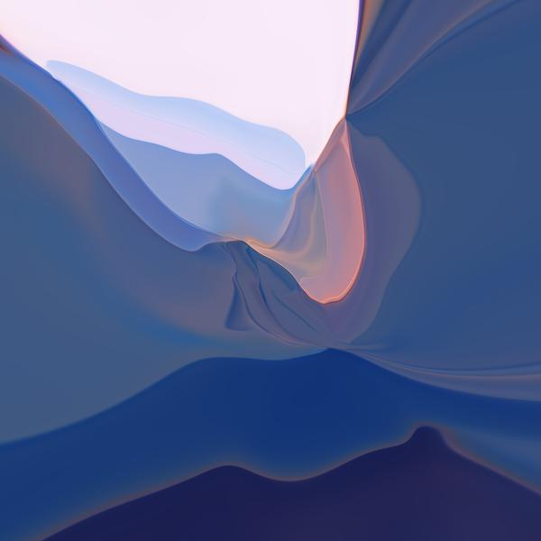

**Art Me Association**, a non-profit organization based in Switzerland, aims to discover innovative new art and introduce it to society. We promote and support emerging new generation artists and especially those working at the interfaces of generative art, artificial intelligence, photography and digital imaging.  Our artists use these techniques to reveal extraordinary inspiration, mystery, emotion, spirituality and beauty in a variety of mediums.

**Art Me** believes that art should inspire a personal response and reflection in every soul, where the boundaries are extended and the mind is opened to new perspectives on human life and society.  

**Art Me** is open to cooperation with all interested art market participants in Switzerland and abroad who share this aspiration for involvement in diverse and innovative art projects.

## Projects

    
     
    <a href="https://issuu.com/78145/docs/art-zurich-2018-catalogue/16">catalog entry</a>

## Artists

**Jana Sam & Alexander Mordvintsev**: Stunning Contemporary Innovation

Extraordinary Artistic Duo: Alex Mordvintsev and Jana Sam build a bridge between abstract mathematical spaces emerging from artificial intelligence networks and the language of visual arts to create a mind blowing array of digital discoveries.

Alex Mordvintsev has worked for nearly ten years on various industrial and research applications of image processing and computer vision. He joined Google Zurich in 2014, where he started to work on the understanding and interpretation of machine learning models based on deep neural networks. In 2015 he developed the DeepDream algorithm, attracting wide public attention to the emergent generative capabilities of these techniques.

Jana Sam is Alex’ wife, creative partner and source of inspiration. She has closely followed Alexander’s work for many years, bringing her advice and insights to the deep connections between mathematical interpretation and visual impact. These two artists build on deep expertise in modern artificial intelligence to constantly develop contemporary and dynamic new outcomes. Their art depicts the human subconscious, desires and emotions, spirituality, memories and fantasies, released through artificial intelligence emerged from the results of web search engines. They provide a unique and distinctive experience, surprising the viewer with thoughtful and positive emotions, as the Impressionism of the past merges seamlessly into elements of the Inceptionism of the future.

## Press

* [Vienna News: Künstliche Intelligenz kann auch Kunst, 31.08.2018](https://vienna-news.com/kuenstliche-intelligenz-kann-auch-kunst-zu-erleben-auf-der-20-kunstmesse-zuerich-20-23-september/)

## Contacts

* phone: +41 79 833 0285
* email: [info@artme.ch](mailto:info@artme.ch)
* [facebook.com/artmeassociation](https://www.facebook.com/artmeassociation/)
