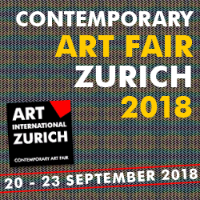

**Art Me Association**, a non-profit organization based in Switzerland, aims to discover innovative new art and introduce it to society. We promote and support emerging new generation artists and especially those working at the interfaces of generative art, artificial intelligence, photography and digital imaging.  Our artists use these techniques to reveal extraordinary inspiration, mystery, emotion, spirituality and beauty in a variety of mediums.

**Art Me** believes that art should inspire a personal response and reflection in every soul, where the boundaries are extended and the mind is opened to new perspectives on human life and society.  

**Art Me** is open to cooperation with all interested art market participants in Switzerland and abroad who share this aspiration for involvement in diverse and innovative art projects.

## Projects

[catalog entry](https://issuu.com/78145/docs/art-zurich-2018-catalogue/16)

## Press

* [Vienna News: Künstliche Intelligenz kann auch Kunst, 31.08.2018](https://vienna-news.com/kuenstliche-intelligenz-kann-auch-kunst-zu-erleben-auf-der-20-kunstmesse-zuerich-20-23-september/)

## Contacts

email: [info@artme.ch](mailto:info@artme.ch)
